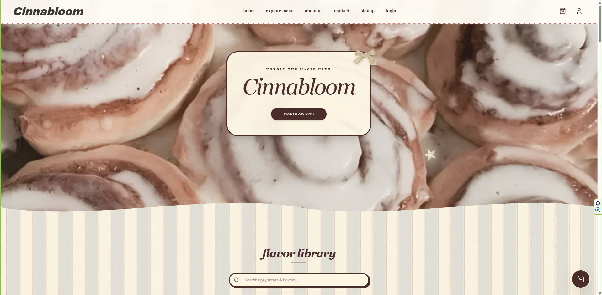

# 🥐 Cinnabloom Bakery

> A full-stack web application for ordering delicious artisanal cinnamon rolls and freshly baked treats.

[](https://cinnabloom-bakery.vercel.app/)

---



---

## 🚀 Live Links

* **Client / Web Application:** [https://cinnabloom-bakery.vercel.app/](https://cinnabloom-bakery.vercel.app/)
* **Backend Repository:** [Cinnabloom Bakery Server](https://github.com/NairaMehjabin/cinnabloom-bakery-server)

---

## ✨ Features

* **Product Showcase:** Browse bakery items with quality-optimized visuals and categorized filters.
* **User Authentication:** Secure sign-up/login system featuring Google OAuth integration.
* **Shopping Cart & Checkout:** Real-time cart state management for seamless ordering.
* **Responsive Design:** Fully mobile-friendly UI built with Tailwind CSS and Next.js.
* **RESTful API Backend:** Express/Node backend handling authentication, food data, and database connections.

---

## 🛠️ Tech Stack & Dependencies

### Frontend
* **Framework:** [Next.js](https://nextjs.org/) (App Router)
* **UI & Styling:** React, Tailwind CSS, Lucide React Icons
* **Authentication:** NextAuth.js / `@react-oauth/google`
* **HTTP Client:** Axios

### Backend
* **Runtime:** Node.js & Express.js
* **Database:** MongoDB & Mongoose ORM
* **Authentication:** JWT (JSON Web Tokens) & OAuth

---

## 💻 Local Setup & Installation Guide

Follow these steps to run the client application locally on your computer:

### Prerequisites
Make sure you have Node.js (v18 or higher) and Git installed on your system.

### 1. Clone the Repository
```bash
git clone [https://github.com/NairaMehjabin/cinnabloom-bakery.git](https://github.com/NairaMehjabin/cinnabloom-bakery.git)
cd cinnabloom-bakery

2. Install Dependencies
Bash
npm install

3. Environment Configuration
Create a .env.local file in the root directory of the project and add your environment variables:
GEMINI_API_KEY=...
NEXT_PUBLIC_GOOGLE_CLIENT_ID=...
NEXT_PUBLIC_API_URL=...
NEXT_PUBLIC_GOOGLE_CLIENT_SECRET=...

4. Run the Development Server
Bash
npm run dev
Open http://localhost:3000 with your browser to see the application live!
